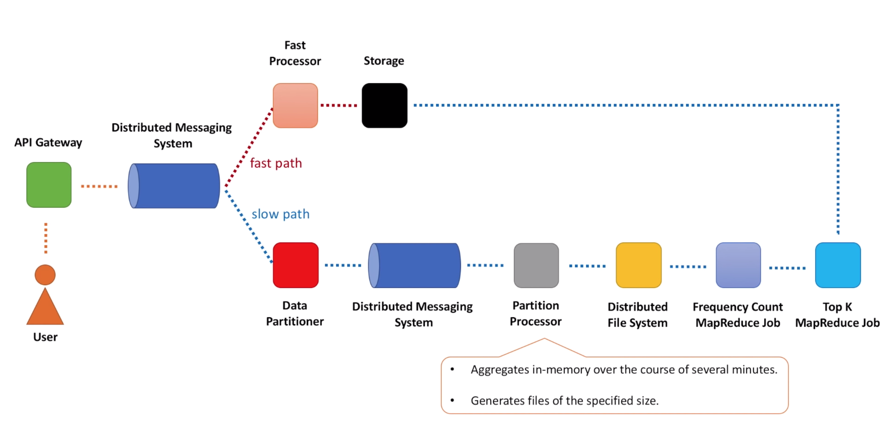

# Example
- Find the 100 most 
    - searched keyword in Google
    - videos viewed on YouTube
    - Played songs on spotify
    - Shared post on facebook
    - Retweeted tweets on Twitter 
    - Liked photo on instagram 
# design constraints
- 100 millions per seconds
    - Database can't handle 100 millions per seconds
- Latency should be 10milli second (i.e. must be precalculated)
- Accuracy (as accurate we can)
# Simple approach 
- scan entries in database
- group by entries and count
- sort by count
- get top k 
This is not effective for scale
# Ring buffer approach 
Solution needs to calculate top 100 list for last
- 1 minute
- 5 minute
- 15 minute
- 60 minute

# Functional requirement 
- topK(k, startTime, endTime)
# Approach 1: Single host hash table
- Assume whole data can be loaded in single machine
- Following list of unique videos 
A B C A A D C A B C
- How to calculate top k?
    - Create hash table that contains frequency count
    - {C: 3, D: 1, A: 4, B: 2}
    - Two approach
        - Sort hash table as per frequency (nlogn)
        - Use min heap data structure of size K (nlogk)
# Approach 2: Scalable approach 

Problems:
- To much memory consumed by processor nodes as well as storage node
# Approach 3: Shards data

- scalable
- good throughput
Problems?
- This is working on bounded data set
- streaming data is not bounded
- How to solve?
    - processor host can store data for only 1 minute and then flush the data
- Can we solve for one hour/one day/one week window?
    - Not easy to solve
    - We need to all data to solve for top k 
- In one hand, we need accumulated data for one day
- on other hand, we can't store one day data in memory
    - One approach is store all data on disk
    - Use batch processing to get topK list
- Is there a simle soln?
    - Yes
    - But need to sacrifice accuracy
# Approach 4: Use of count min sketch data structure
- 2d array
- row is less compare to width 
- row represent hash function

How is data retrieved? For example, what is value of A?
- among all cells of `A` take the minimum value
- Bcz of collision, some cell may contains over estimation
- Taking minimum reduce chances to use the over estimated value
Answer: 3
Q. Why we need several hash function?
A: If use single function then we have to use single row, in that case collision data will produce incorrect result. In this example, it will be `5`
By adding more functions, we decrease the error
Q. How to choose width and height parameter?
A. It depends on following
- e - accuracy we want to have
- d - certainty/probability with which we reach the accuracy
width = Math.ceil(2.0/e)
height = Math.ceil(- Math.log(1-d) / Math.log(2) )

Q. How to apply count min sketch data structure to solve original problem i.e. top k?
A: Count min sketch replace hash table we had in previous soln approach
    - We still need a heap to store the top k
    - replace hash table by count min sketh
    - count min sketch is fixed size
    - never grow in size even if data size increase
# Final architecture

- every time user clicks on video, request goes through API gateway
- API gateway act as single point of contact for content delivery system
- API gateway sends request to backend services
- We are interested in log generation function of API gateway
- every call to api is logged
    - Generally these log is used for monitoring/alerting purpose
- We will use this log to counting how many times a video is viewed
- Implement background process, which will read data from logs
    - does some initial aggregation
    - sends data for further processing
- we allocate buffer in memory and build the frequency hash map table as discussed before
- buffer has limited size, when buffer is full data is full and flushed
- If buffer is not full for specified period of time we can flush based on time
- There are other options
    - aggregate data on the fly and result write into logs
    - completely skip all aggregation at the api gateway side and send all information about every individual videos views to downstream system for further processing
- Build a serialize data in compact binary format to reduce network utilization and let CPU pay the price
- All these consideration depends on what resources are available on API gateway host

fast path: 
    - calculate top k approximately, result will be available in few seconds
slow path:
    - calculate top k precisely, result will be available in few minutes/hours, depends on the data volume

- count mink sketch has fixed memory requirement 
- so its up to you on how much time you would like to wait before flushing data

- Data processing pipeline gradually reduce the request rate
    - millions of users click on videos in a minute
    - it goes to API gateway
    - API gateway may be big, 1000 hots
    - aggregate data on each hosts for x seconds
    - it reduce number of messages goes into kafka
    - fast aggregator collector, it will be small in size
    - when it arrives to storage then it also become smaller

Slow path:
- Use map reduce
- use distributed files system
    - HDFS/S3
- Run two map reduce job
    - one to calculate frequency table
    - second to calculate top k
Q. count min is not accurate, map/reduce is slow. Can we have something in middle?
- Use data partition approach 

# Data flow fast path

# Data flow slow path

# Map reduce

# API to get topK

# More constraints
Q. What if data aggregation is not possible on API gateway due to CPU or other constraints
- We still need the access of logs
- these logs will be send to separate cluster
Q. How big is K?
K can't be arbitrary large
# Drawback?
- Not a normal architecture
- This is called lambda architecture (not AWS lambda)
# Can we solve it using simple data stream, apache kafka?
- it does almost same thing
# Related problem
- Trending topics
- Popular product
- Top k stock
# Reference
https://www.youtube.com/watch?v=kx-XDoPjoHw

